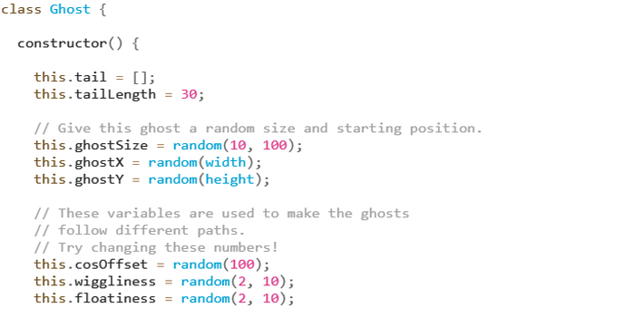
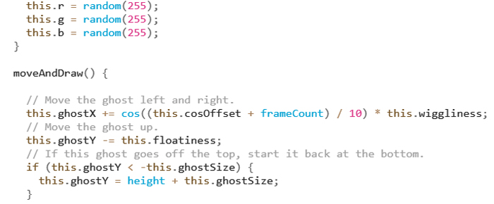

# IDEA9103 Week 8 Quiz

## Part 1: Imaging Technique Inspiration
- Here are two screenshots showing the source of inspiration.
    - 
    - 

- The "floating" effect of those ghosts attracted me and I would like to incorporate such an animation into my project. I have chosen it as an example because: firstly, what has been illustrated is not too abstract. I think it is important that if I create my own work and show it to people, they can quickly understand what they are looking at. This can also let me know whether my work is successful or not. Secondly, by seeing the example, I believe I am able to create a similar effect based on the coding knowledge I have learnt so far. While it is not an "impossible" mission, it allow me to not only practise my current coding skills, but also explore further functionalities and practical techniques.

## Part 2: Coding Technique Exploration
- Making objects wiggle (move left and right) and move upwards is key to achieve a sense of floating. I would like to use *class* to create more than one objects, and use some mathematical calculations to determine their x and y positions at every moment during the animation.

- Here are two screenshots of the chosen example's implementation.
     - 
     - 

- Here is the link to the implementation.
    - [GHOSTS](https://happycoding.io/tutorials/p5js/creating-classes/ghosts)